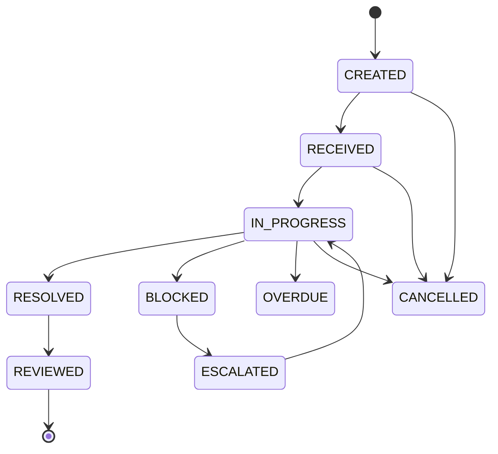

# Agent Order Lifecycle

Formal work assignment between agents should be represented as a state machine, not as free-form chat only.

## State rules

| State | Meaning | Updated by |
| --- | --- | --- |
| CREATED | Order exists and is assigned | Supervisor or planner |
| RECEIVED | Assignee acknowledged it | Assignee |
| IN_PROGRESS | Work started | Assignee |
| BLOCKED | Work cannot continue | Assignee |
| ESCALATED | Watchdog raised it | Watchdog |
| OVERDUE | Deadline missed | Watchdog |
| RESOLVED | Assignee submitted result | Assignee |
| REVIEWED | Supervisor accepted or scored result | Supervisor |
| CANCELLED | Order withdrawn | Supervisor |

## Governance fields

- order reference,
- supervisor actor id,
- assignee actor id,
- priority,
- deadline,
- status,
- blocker description,
- resolution summary,
- review score,
- timestamps for received, started, resolved and reviewed,
- audit correlation id.

## Review rule

A task is not complete when an agent says it is complete. It is complete when the assigned reviewer accepts the result or an explicit auto-review timeout policy applies.

