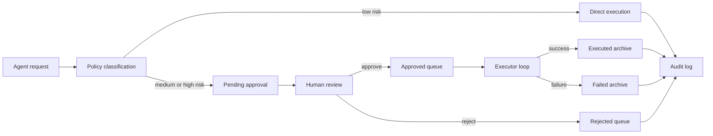

# Approval and Audit Model

## Request lifecycle

## Audit event fields

Each event should include:

- timestamp,
- request id,
- actor id,
- effective OS user or runtime identity,
- action name,
- target path, resource or service,
- risk level,
- approval id when required,
- result status,
- failure reason when applicable,
- correlation id for multi-step workflows.

## Executor behavior

The executor should be intentionally small:

- read only approved request files,
- parse structured JSON,
- route by explicit action name,
- reject unknown actions,
- never infer missing destructive intent,
- move processed requests to immutable result folders,
- append audit events before and after execution.

## Why this matters

This structure creates evidence for regulatory and security review: who requested an action, who approved it, what actually ran, when it ran and what happened.

