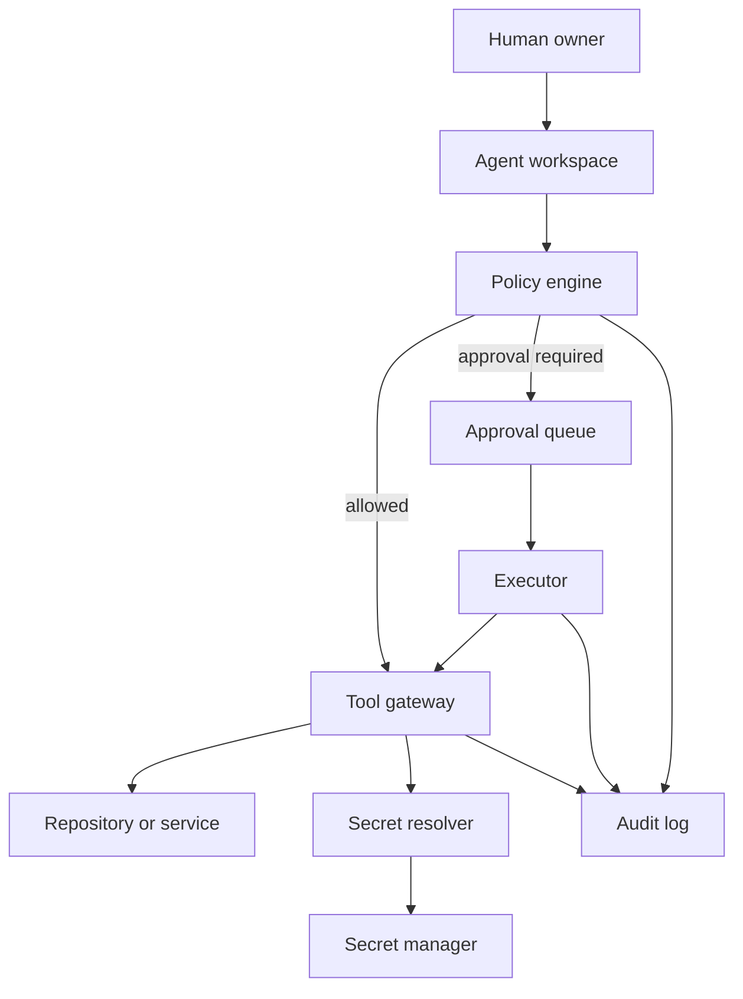

# Security Architecture Pattern

The recommended model is a narrow-waist architecture: agents can reason broadly, but execute only through a small controlled interface.

## Boundary rules

- Agents do not receive broad filesystem mounts by default.
- Agents do not receive long-lived credentials in prompt context.
- Network tools are separated from local filesystem tools.
- Production actions require approval and narrower execution identity.
- Evidence collection is read-only unless an explicit remediation step is approved.

## Control examples

| Risk | Control |
| --- | --- |
| Prompt injection | Treat external text as untrusted data; do not let it change policy |
| Secret exfiltration | Secret resolver returns scoped handles; audit access without values |
| Destructive shell | Pre-tool denylist and approval queue |
| Unauthorized writes | OS permissions plus allowed-root checks |
| Silent policy drift | Config-change hook and review requirement |
| Lost context | Pre-compact durable note extraction |

